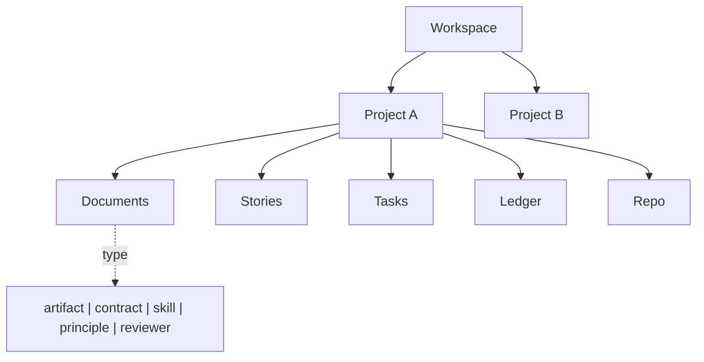
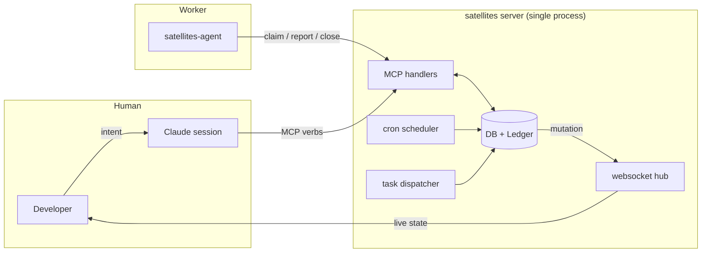
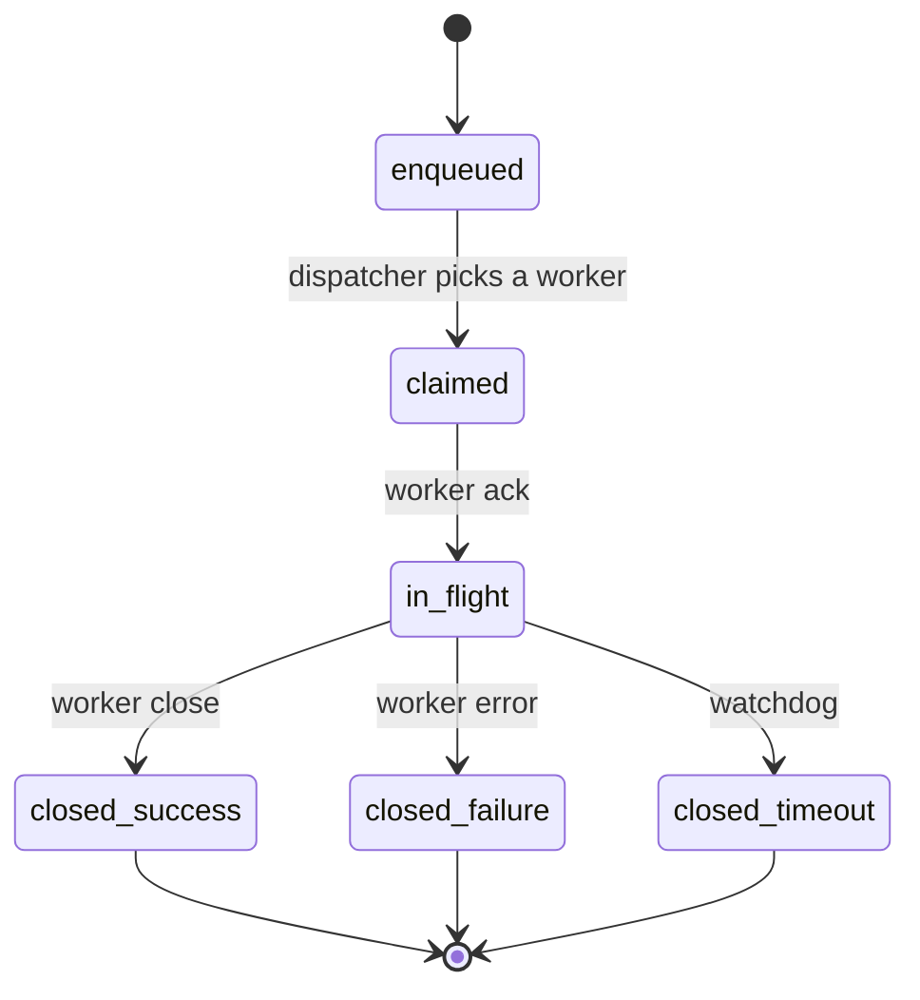
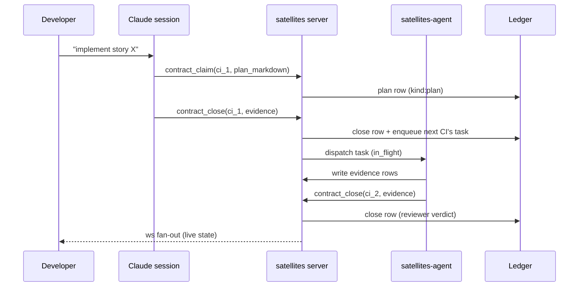
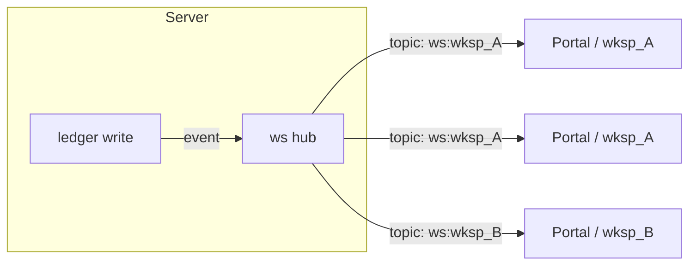

# Satellites v4 — Architecture

Authoritative reference for the v4 substrate. Every implementation epic must source its scope from this document. Decisions trace to one or more of the twelve v4 principles seeded on the project. Principles are cited by short name throughout; the authoritative full names and rationales live on the project's principle documents in the v4 document store.

Short names used in this document:

| Short name | Full principle |
|------------|----------------|
| Project is top-level primitive | Project is the top-level primitive within a workspace |
| Five primitives per project | Five primitives per project: documents, stories, tasks, ledger, repo |
| Documents share one schema | Documents share one schema, discriminated by type |
| Story is the unit | Story is the unit of work; epics are tags, not primitives |
| Tasks are the queue | Tasks are the orchestration queue |
| Satellites-agent is the worker | Satellites-agent is the worker; orchestration lives elsewhere |
| Preplan scope is tight | Preplan scope is tight: relevance, dependencies, prior delivery, decision |
| Documents drive feature stories | Documents drive feature stories |
| Repo is a first-class primitive | Repo is a first-class primitive with a semantic index |
| Evidence is the primary trust leverage | Evidence is the primary trust leverage |
| Process order and evidence are first-class | Process order and evidence are first-class; no shortcuts |
| Workspace is the multi-tenant primitive | Workspace is the multi-tenant isolation primitive |

---

## 1. Positioning

**Thesis.** Satellites trusts agents via evidence, not autonomy. Claude + MCP is the deliberate constraint that makes rich evidence possible — a narrower agent surface earns a deeper per-step protocol, and the protocol's artefacts are what a human inspects to decide whether an autonomous change is acceptable.

**Two-axis tradeoff.** Peer-autonomy platforms widen the agent surface (multi-provider, tool-selection, memory-across-sessions) and pay with weaker audit chains — the reviewer ends up trusting the agent's judgement. v4 picks the other axis: narrow agent surface → rich MCP protocol → dense evidence per step → audit-grade trust. The cost is lower agent optionality; the return is a ledger a human (or another agent) can walk end-to-end without re-litigating each decision.

```
 agent surface (wide) ─────────────────────────▶ (narrow)
        │                                          │
        ▼                                          ▼
 autonomy-leaning                        evidence-leaning
 (Multica, peer-agent platforms)         (Satellites v4)

 trust model: agent capability          trust model: audit-surviving evidence
```

**Related work.**

- **Multica** (agents-as-peers via autonomy + skill accumulation). Gets right: agents learn from outcomes, collaborate across sessions, and compound skills. Takes a different stance: trust is emergent from competence rather than constructed from evidence. v4's bet is that emergent trust is hard to audit after the fact, especially in regulated or multi-tenant settings — so v4 forgoes skill-accumulation-driven autonomy in exchange for a ledger that a reviewer can read end-to-end without re-running the agent.
- **Classic CI/PR review.** Gets right: every change passes a reviewable checkpoint. Takes a different stance: v4 pushes the review boundary earlier — preplan, plan, develop, story_close each leave evidence, not just the final diff.

**Principles:** Evidence is the primary trust leverage.

---

## 2. Primitives

### Hierarchy



*Diagram 1 — primitive relationships.*

### Workspace

- Top-level multi-tenant primitive. Hard data isolation between customers sharing the same server.
- Owns a set of users (via membership) and a set of projects.
- Every row in every downstream table carries `workspace_id`.

### Project

- Work container inside a workspace. Everything below belongs to exactly one project.
- Owns exactly five primitives: **documents**, **stories**, **tasks**, **ledger**, **repo**.
- No cross-project read path at the data layer; cross-project rollup is an application-layer operation with explicit workspace admin grant.

### Documents

One schema, `type` discriminator. Types:

| type | purpose | key fields |
|------|---------|------------|
| `artifact` | plan.md / review-criteria.md / diffs / evidence attachments | `story_id`, `phase`, body |
| `contract` | lifecycle stage definition (preplan, plan, develop, …) | `category`, `required_for_close`, `validation_mode`, agent instruction |
| `skill` | reusable process definition bound to a contract category | `contract_binding` (optional), markdown body |
| `principle` | operating rule | scope (`system` / `project`), tags |
| `reviewer` | LLM-reviewer configuration | `contract_binding`, rubric body |
| `configuration` | named project-scoped bundle of refs to one ordered contract list (workflow shape) plus skill and principle ref sets — stories and agents pick a Configuration to override the implicit project default (story_d371f155). Distinct from the `/projects/{id}/configuration` viewer page (story_433d0661), which is a read-only list of contract+skill documents. | `structured` JSON: `{contract_refs[], skill_refs[], principle_refs[]}`; refs validated against active documents of the matching type in the same workspace |

Schema shape (one table):

```
document {
  id:                ULID
  workspace_id:      FK (every query scoped)
  project_id:        FK (nullable only for system-scope documents)
  type:              enum(artifact,contract,skill,principle,reviewer)
  name:              string
  body:              markdown
  structured:        JSON  // type-specific payload
  contract_binding:  FK document(type=contract)  // skills/reviewers only
  scope:             enum(system, project)
  tags:              []string
  status:            enum(active, archived)
  created_at/by, updated_at/by
}
```

Indexes: `(workspace_id, project_id, type, status)` for the default query path; `(workspace_id, type, scope)` for system-scope reads; `(contract_binding)` for skill/reviewer lookups.

#### Semantic search & document_chunks (story_5abfe61c)

Embeddings sit alongside the parent row in a sibling table `document_chunks`:

```
document_chunks {
  id:               ULID
  document_id:      FK document
  workspace_id:     FK (every query scoped)
  chunk_idx:        int
  body:             string  // chunked window of document.body
  embedding:        []float32
  embedding_model:  string  // e.g. "text-embedding-004"
  created_at:       timestamp
}
```

Chunks are written by a Gemini-backed ingestion path (`internal/embeddings`). The `document_search` MCP verb routes its non-empty-query branch to `document.Store.SearchSemantic`, which embeds the query, runs cosine similarity over chunks pre-filtered by structured filters (type/scope/tags/contract_binding/project_id), groups hits by parent and returns documents in score order with `BestChunkScore` populated. Empty-query calls fall through to `Search` (filter-only). On deploys without an embedder configured (no `EMBEDDINGS_PROVIDER`) the verb falls back gracefully to `Search`.

Provider config flows from env vars: `EMBEDDINGS_PROVIDER` (`gemini` / `stub` / `none`), `EMBEDDINGS_MODEL`, `EMBEDDINGS_API_KEY`, `EMBEDDINGS_DIMENSION`, `EMBEDDINGS_BASE_URL`. See `internal/embeddings/config.go`.

### Stories

Unit of deliverable work. Epics exist only as `epic:<tag>`; no sub-stories, no subtasks.

```
story {
  id, workspace_id, project_id,
  title, description, acceptance_criteria,
  status:     enum(backlog, ready, in_progress, done, cancelled, blocked),
  category:   enum(feature, bug, improvement, infrastructure, documentation),
  priority:   enum(critical, high, medium, low),
  tags:       []string,    // includes epic:*, feature-order:*
  source_documents: []FK document  // per "Documents drive feature stories"
  estimated_points, actual_points, resolution,
  created_at/by, updated_at/by
}
```

### Tasks

Orchestration queue. One table covers every origin.

```
task {
  id, workspace_id, project_id,
  origin:          enum(story_stage, scheduled, story_producing, free_preplan, event),
  trigger:         JSON  // stage FK, cron expr, event id, …
  payload:         JSON  // contract_instance_id, story_id, etc.
  status:          enum(enqueued, claimed, in_flight, closed),
  claimed_by:      agent_id,
  claimed_at, completed_at,
  outcome:         enum(success, failure, timeout)
  ledger_root_id:  FK ledger  // first row the task wrote
  created_at
}
```

### Ledger

Append-only event log. See section 6.

### Repo

First-class primitive per "Repo is a first-class primitive". See section 7.

**Principles:** Workspace is the multi-tenant primitive, Project is top-level primitive, Five primitives per project, Documents share one schema, Story is the unit, Tasks are the queue, Repo is a first-class primitive.

---

## 3. Services

### Topology



*Diagram 2 — service topology.*

### Satellites server

Single Go process. Owns:

- **State** — DB (documents, stories, tasks, ledger, repos) scoped by `workspace_id`.
- **MCP surface** — every verb the Claude session or agent calls.
- **Cron** — scheduled tasks (backlog maintenance, next-story selection).
- **Task dispatcher** — matches enqueued tasks to available workers, workspace-scoped.
- **Websocket hub** — fan-out of ledger mutations to subscribed clients (workspace-scoped).
- **Process-order gate** — enforces that contract N+1 cannot claim until contract N has a close-row on the ledger (see section 5).

The server does not decide *what to do next*; it dispatches what orchestrators (Claude session, cron) have enqueued.

### Satellites-agent

Worker. One binary, one role: pull a claimed task, execute it, write evidence, close. Never calls "pick the next story" verbs — orchestration lives with the Claude session or cron, not the worker. Runs in one of two modes:

- **Stage-execute** — task payload names a `contract_instance_id`; agent runs that contract's agent_instruction.
- **Free-standing** — task payload names a script/command; agent runs it with captured stdout/stderr as evidence.

### Claude session

Interactive orchestrator. The human operates it; it calls MCP verbs to decide *what to do next* (which story to file, which contract to claim, what plan to submit). No server-side task-producing cron is required for Claude-driven flows — the session is the trigger.

**Principles:** Satellites-agent is the worker, Tasks are the queue.

---

## 4. Task queue

### Origins

| origin | trigger | typical payload |
|--------|---------|-----------------|
| `story_stage` | contract close on story N triggers contract N+1 | `{contract_instance_id, story_id}` |
| `scheduled` | cron expression | `{script_id}` or `{producer_name}` |
| `story_producing` | cron or event → creates a new story + enqueues its first stage | `{template_id, context}` |
| `free_preplan` | user/agent files a preplan task without a parent story | `{target_story_id?, question}` |
| `event` | DB event, external webhook | `{event_id, handler_name}` |

### Lifecycle



*Diagram 3 — task lifecycle.*

### Dispatch rules

1. **Workspace isolation.** Dispatcher filters the enqueued set to the worker's workspace. A worker in workspace `w1` cannot claim a task from `w2`. Enforced at the query layer, not by worker cooperation.
2. **Ordering.** FIFO within workspace + priority bucket. Priority comes from the story (`critical` > `high` > `medium` > `low`) for stage tasks; scheduled/event tasks default to `medium`.
3. **Claim expiry.** A claimed task without a close row in 2× its expected duration is reclaimed; the original claimer gets a `timeout` close marker it cannot override.
4. **Backpressure.** If worker concurrency is saturated, new tasks wait; they are not rejected. The queue is the shape that absorbs load.

### Typical orchestration flow



*Diagram 4 — typical orchestration flow.*

**Principles:** Tasks are the queue, Satellites-agent is the worker, Workspace is the multi-tenant primitive.

---

## 5. Lifecycle + contracts

### Stages are documents

A contract is a `document{type=contract}` row. Fields:

- `category` — `pre-plan`, `plan`, `develop`, `test`, `commit`, `push`, `merge_to_main`, `story-close`, `delivery-review` (extensible).
- `required_for_close` — whether a story cannot close without this stage passing.
- `validation_mode` — `llm`, `check-based`, or `agent` (close-via-worker).
- `agent_instruction` — markdown body telling the agent exactly what evidence to submit.
- `checks` — structured check definitions the server runs server-side (e.g. `artifact_exists`).
- `scope` — `system` (lifecycle shell) vs `project` (per-project work contracts).

### Workflow is a list of contract names per story

When a story is accepted, an agent (or the project's default template) proposes an ordered list of contract names. The server instantiates one `contract_instance` (CI) row per slot:

```
contract_instance {
  id, workspace_id, project_id, story_id,
  contract_id (FK document),
  contract_name, phase, sequence,
  status:      enum(ready, claimed, passed, failed, skipped),
  claimed_via_grant_id, claimed_at,
  plan_ledger_id, close_ledger_id,
  required_for_close,
}
```

There is **no separate `workflow` table** — the list of CIs for a story IS the workflow. This follows directly from "Five primitives per project": workflow is not a sixth primitive.

### Preplan is tight

Preplan answers one question: *should we do this story?* Evidence is four fields — relevance, dependencies, prior-delivery, recommendation — plus an optional `pipeline_selected` decision for downstream sizing. AC amendments, workflow selection, and task-list generation are the `plan` stage's responsibility.

### Process-order gate (server-side invariant, not a convention)

The gate lives in the MCP handler for `contract_claim`. On each claim attempt:

1. Look up the CI by `id`. Fail if status ≠ `ready`.
2. Look up all CIs on the same story with `sequence < claimed.sequence` and `required_for_close = true`.
3. For each such predecessor, assert `status ∈ {passed, skipped}`.
4. If any predecessor is not yet passed, **reject the claim** with a structured error naming the blocking CI.

This is not a guideline — the code path is the gate. A capable agent that submits a later-stage claim without the predecessor ledger row in place gets the same rejection as a poor one. The gate also asserts `session_id` matches the chat UUID the SessionStart hook registered, so claims cannot be forged across sessions.

**What the gate verifies (end-to-end):**

- Predecessor CIs are terminal (passed or explicitly skipped).
- The claiming session is registered with the SessionStart hook.
- For close calls: the CI belongs to a session the server knows about.
- For preplan close: if a `proposed_workflow` is attached, it satisfies the project's `workflow_spec` (required slots, min/max counts).

Bypass is not a feature. The reviewer-review contract's rubric can flag weak evidence; the process-order gate refuses to advance without the prior ledger row at all.

**Principles:** Preplan scope is tight, Process order and evidence are first-class, Story is the unit, Five primitives per project.

---

## 6. Ledger

### Shape

Append-only event log. Every phase of every contract writes at least one row. Row types:

| type | example kind tags | purpose |
|------|-------------------|---------|
| `plan` | `kind:plan` | agent's submitted plan on claim |
| `action_claim` | `kind:action-claim` | permissions + session binding |
| `artifact` | `artifact:plan.md`, `artifact:review-criteria.md` | referenced deliverables |
| `evidence` | `kind:evidence` | close-time evidence blob |
| `decision` | `kind:pipeline-selection` | structured decision snapshot |
| `close-request` | `phase:close` | contract close-request marker |
| `verdict` | `kind:story-review` | reviewer assessment |
| `workflow-claim` | `kind:workflow-claim` | proposed workflow submitted at preplan close |
| `kv` | — | key-value state derived from upstream rows |

Schema (one table):

```
ledger {
  id, workspace_id, project_id, story_id?, contract_id?,
  type, tags: []string, content: markdown, structured: JSON,
  durability: enum(ephemeral, pipeline, durable),
  expires_at?: timestamp,  // required for ephemeral
  source_type: enum(manifest, feedback, agent, user, system, migration),
  sensitive: bool,
  status: enum(active, archived, dereferenced),
  created_at, created_by
}
```

Indexes: `(workspace_id, story_id, created_at)` for story timeline; `(workspace_id, contract_id)` for contract evidence scans; `(workspace_id, tags)` partial GIN for tag-filtered lookups.

#### Semantic search & ledger_chunks (story_5abfe61c)

Mirroring the documents shape, ledger rows have a sibling `ledger_chunks` table:

```
ledger_chunks {
  id:               ULID
  ledger_id:        FK ledger
  workspace_id:     FK (every query scoped)
  chunk_idx:        int
  body:             string  // chunked window of ledger.content
  embedding:        []float32
  embedding_model:  string
  created_at:       timestamp
}
```

Only `Content` is chunked — `Structured` JSON payloads stay queryable through the existing tag/JSON filter path. The `ledger_search` MCP verb routes its non-empty-query branch to `ledger.Store.SearchSemantic`, which embeds the query and runs cosine over chunks pre-filtered by ListOptions (type/story_id/contract_id/tags/...). Dereferenced rows are excluded; `Dereference` cascades to `chunkStore.DeleteByLedgerID` so chunks vanish on status flip — the parent-status filter at search time is the defence-in-depth.

Skip rules at ingestion time: `Type=kv` rows shorter than 64 chars (single-value KV), `Type=action_claim` rows (JSON-shaped permission lists), empty Content, archived rows. The same Gemini-backed `internal/embeddings` client serves both primitives.

### Websocket fan-out

Mutations to the ledger (and to stories, tasks, contract_instances) stream to a websocket hub. Subscribers join workspace-scoped topics:



*Diagram 5 — websocket fan-out, workspace-scoped.*

Prior-art note: v3 already proved this pattern with `LedgerEventListener` + in-process hub + per-subscriber filter. v4 lifts it and adds the workspace topic prefix so subscribers cannot observe another workspace's mutations even if they hold a session.

### Derivations

What the ledger stores vs. what is derived:

| stored | derived from ledger |
|--------|---------------------|
| contract_instance.status | (none — mutation applied in same tx as close-row) |
| story.status | (none — explicit `story_close` transition) |
| ledger row | — |
| ephemeral kv | latest `kv` row per key |
| story timeline view | filter + project ledger by story_id |
| cost rollup (epic_summary) | aggregate `kind:llm-usage` rows |
| reviewer verdict trail | filter by `kind:verdict` per story |

Derivations are re-computable; deleting a derivation's cache and replaying the ledger reproduces the same state.

**Principles:** Evidence is the primary trust leverage, Five primitives per project, Workspace is the multi-tenant primitive.

---

## 7. Repo + index

### Model

Each project has exactly zero or one repo record:

```
repo {
  id, workspace_id, project_id,
  git_remote, default_branch,
  head_sha, last_indexed_at,
  index_version, symbol_count, file_count,
  status: enum(active, archived)
}
```

### Index regeneration

Triggers:

- **Commit on main** — server receives a webhook (or push-mirrored commit); enqueues an `event`-origin task (`origin:event, handler:reindex_repo`). The worker runs the indexer and writes the new `head_sha` + `last_indexed_at`.
- **Manual** — MCP verb `repo_scan(repo_id=...)` enqueues the same task.
- **Stale-check cron** — nightly sweep; any repo whose `head_sha` differs from the tracked remote is re-enqueued.

Indexing uses jcodemunch's symbol/semantic pipeline. The index lives outside the satellites DB (jcodemunch owns its own storage); satellites keeps a pointer (`repo_id`) and surfaces query verbs.

### MCP query surface

- `repo_search(repo_id, query, kind?, language?)` — symbol lookup.
- `repo_search_text(repo_id, query, file_pattern?)` — full-text.
- `repo_get_symbol_source(repo_id, symbol_id)` — source of one symbol.
- `repo_get_file(repo_id, path)` — raw file content.
- `repo_get_outline(repo_id, path)` — file outline (symbols + nesting).

Every verb is workspace-scoped (the caller must have membership on the workspace that owns the `repo_id`). Agents and Claude sessions use these instead of cloning.

**Principles:** Repo is a first-class primitive, Workspace is the multi-tenant primitive.

---

## 8. Tenancy + isolation

### Workspace is the hard boundary

Every row at every layer carries `workspace_id`. Every query filter includes it. Cross-workspace access is not an oversight-of-the-day; it is a design invariant:

| layer | enforcement |
|-------|-------------|
| DB | every table has `workspace_id`; every query path filters on it; FK rows reject a parent with mismatched workspace |
| MCP | handler resolves the caller's workspace memberships from the auth context; rejects resource references outside those memberships |
| Task dispatcher | pulls candidate tasks with `workspace_id IN :memberships`; never exposes cross-workspace tasks to a worker |
| Websocket hub | subscribers connect to `ws:<workspace_id>` topics; the hub discards events with mismatched `workspace_id` before fan-out |
| Cron | scheduled jobs carry a `workspace_id` in their trigger payload; they run in one workspace's scope |

### User ↔ workspace membership

```
workspace_member {
  workspace_id, user_id,
  role: enum(admin, member, reviewer, viewer),
  added_at, added_by
}
```

A user is a member of zero or more workspaces. Session auth resolves the caller's user_id; every MCP call computes the effective membership set and filters from there.

### What cannot cross a workspace boundary

- Documents (principles, contracts, skills, reviewers, artifacts).
- Stories, tasks, ledger rows, CIs.
- Repo references + index queries.
- Websocket events.
- Cron-produced tasks.
- Session claims.
- **Everything.** There is no cross-workspace read path at the data layer. Administrative reporting that needs cross-workspace visibility (e.g. platform ops) lives on a separate admin surface with its own audit.

### System-scope documents

The lifecycle contracts (preplan, plan, story_close) are `scope:system` and `workspace_id = NULL`. They are visible to every workspace's queries but seeded via platform bootstrap, not MCP mutation (per the lifecycle/project contract separation rule). This is the only non-workspace-scoped read path, and it is read-only.

**Principles:** Workspace is the multi-tenant primitive.

---

## 9. Protocols

### MCP verbs (orchestrator surface)

Grouped by primitive. Every verb is workspace-scoped at the handler.

- **Project:** `project_status`, `project_get`, `project_create`, `project_list`, `project_update`, `project_focus`, `project_settings_*`.
- **Document:** `document_create`, `document_get`, `document_list`, `document_update`, `document_delete`, `document_search`. Type-specific thin wrappers (`principle_*`, `contract_*`, `skill_*`, `reviewer_*`) forward to the generic verbs.
- **Story:** `story_create`, `story_get`, `story_list`, `story_update`, `story_close`, `workflow_claim`, `contract_next`, `contract_claim`, `contract_close`, `contract_respond`, `contract_resume`.
- **Task:** `task_enqueue`, `task_get`, `task_list`, `task_claim`, `task_close`.
- **Ledger:** `ledger_add`, `ledger_get`, `ledger_list`, `ledger_search`, `ledger_recall`.
- **Repo:** `repo_add`, `repo_get`, `repo_list`, `repo_scan`, `repo_search`, `repo_search_text`, `repo_get_symbol_source`, `repo_get_file`, `repo_get_outline`.
- **Session:** `session_whoami` (returns canonical chat UUID from the SessionStart hook), `session_register` (called by the SessionStart hook).

#### `.mcp.json` workspace_id carrier (story_798631fd)

When an MCP client (Claude Code session, satellites-agent worker, or any tool consuming the MCP surface) operates against a specific workspace, the convention is to carry the workspace id through `.mcp.json` and pass it on `session_register`. This binds the session row to that workspace; subsequent `session_whoami` calls echo the bound id, and future verbs that need a workspace-scoped resolution can read it from the session registry rather than re-deriving from the project on every call.

The substrate is project → workspace deterministic today (every project carries `workspace_id`), so explicit binding is only required when the same git remote could plausibly be added under multiple workspaces (e.g. an agency repo cloned into a Magentus client workspace alongside the agency's own).

Example `.mcp.json` entry:

```json
{
  "mcpServers": {
    "satellites": {
      "command": "satellites-mcp",
      "args": ["--default-workspace", "wksp_alpha"],
      "env": {
        "SATELLITES_MCP_URL": "https://satellites.example.com/mcp"
      }
    }
  }
}
```

The harness's SessionStart hook reads `--default-workspace` and includes it as `workspace_id` on the `session_register` call. Empty / omitted is fine — the session simply runs unbound until a future verb stamps a workspace on it.

### Worker ↔ server protocol

The satellites-agent speaks the same MCP as the Claude session, but via a task-driven loop:

```
loop:
  1. task = task_claim(worker_id, workspace_id)       # server picks next enqueued task in worker's workspace
  2. context = ledger_recall(task.ledger_root_id)     # load any existing evidence on the parent contract
  3. run contract's agent_instruction (drives MCP writes: ledger_add, story_update, ...)
  4. task_close(task.id, outcome, evidence_refs)      # server re-checks process-order gate on outcome=success
```

Worker concurrency is bounded per workspace (capacity = `workspace.settings.agent_concurrency`). Claim expiry + reclaim handles stuck workers.

### Trust boundaries

| boundary | server verifies | worker reports |
|----------|----------------|----------------|
| claim | session_id matches SessionStart hook registration; process-order gate passes; CI is `ready`; workspace membership | intended plan_markdown; permissions_claim |
| close | predecessor CIs are terminal; evidence_markdown is non-empty when required; LLM-reviewer verdict is recorded for `validation_mode:llm` | evidence content; ledger refs |
| task dispatch | workspace isolation; priority ordering; claim expiry | heartbeat + progress (optional) |
| websocket | workspace_id matches subscriber topic | — |

The rule: **nothing the worker reports is taken at face value without a server-side check that could, in principle, reject it.** Evidence is the audit trail *after* the gate accepts — the gate is the trust primitive.

**Principles:** Evidence is the primary trust leverage, Process order and evidence are first-class, Satellites-agent is the worker.

---

## 10. Out of scope for this document

- **Portal / UI design** — covered by `docs/ui-design.md`.
- **Deployment + infrastructure** — covered in the `satellites-v4-infra` project.
- **Specific implementation language/framework for each component** unless architectural (Go for server + agent is carried from v3 and v4 bootstrap; any cross-language choice would get its own design note).
- **Migration from v3** — v4 is greenfield on purpose; there is no data migration from v3 planned under this document.
- **Observability details** (dashboards, metric names, alert thresholds) — future `docs/observability.md`.
- **Auth / identity provider integration** — future `docs/auth.md`; this document establishes that workspace membership is the authorisation primitive, not how identities are federated.

---

## V3 mistakes v4 avoids (and why)

1. **No workspace tier.** v3 rooted everything at the project level. Retrofitting tenancy is the hardest shape to add after the fact; v4 commits to workspace from bootstrap so every index, query, and websocket topic carries `workspace_id` from day one ("Workspace is the multi-tenant primitive").
2. **Separate tables per document kind.** v3 grew a principle table, contract table, skill table, reviewer table, artifact store — each with its own CRUD surface, drift, and migration overhead. v4 uses one `document` table with a `type` discriminator ("Documents share one schema"); one search index, one backup path, one migration.
3. **Implicit pipelines + workflows as separate primitives.** v3 had pipeline-shape AND workflow-shape AND contract tables, with emergent coupling between them. v4 collapses: the workflow IS the ordered list of CIs on a story; "Five primitives per project" limits the primitives to five.
4. **Orchestration logic inside the agent.** v3 agents sometimes decided their own next action. v4 enforces the split ("Satellites-agent is the worker") — orchestrators (Claude, cron) decide; workers execute.
5. **No server-side process-order gate.** v3 relied on convention — phases were expected to run in order, but the server would accept a late-stage claim without the predecessor evidence row. v4 makes the gate load-bearing ("Process order and evidence are first-class"): skipping a phase is a server-side rejection, not a cultural lapse.
6. **Preplan-as-mini-plan drift.** v3 preplans trended toward proposing task breakdowns and AC amendments — the `plan` stage's job. v4 scopes preplan tight ("Preplan scope is tight") to the proceed/cancel decision.
7. **Sub-stories / subtasks.** v3 had optional parent-child story relationships; v4 removes them ("Story is the unit") — every unit of work is a top-level story with its own lifecycle and evidence.
8. **Feature stories without documents.** v3 allowed features to be filed directly from chat; scope disputes became un-resolvable. v4 ties feature stories to documents ("Documents drive feature stories"); bugs/ops/infra are the only categories exempted.

## Prior-art lifted from v3 (with credit)

1. **Websocket ledger fan-out.** v3's `LedgerEventListener` + in-process hub + per-subscriber filter is the right shape for live state. v4 keeps the pattern and adds workspace topic scoping.
2. **MCP-first orchestrator surface.** v3 proved that every agent action through MCP produces a cleaner audit trail than agent-side toolchain orchestration. v4 doubles down on this.
3. **Contract-instance per stage.** v3 introduced CIs after the "pipeline row" era and the gain was immediate — stage-level ledger scoping, stage-level claim/close/reviewer verdict. v4 keeps CIs as-is.
4. **Principle-cited reviewer verdicts.** v3's reviewer rubrics cite principle names when rejecting; v4 keeps that, with all twelve v4 principles seeded up front.
5. **Pipeline-selection as an explicit decision.** v3's preplan added `pipeline_selected` as a structured ledger field. v4 retains it.

---

## Principle traceability matrix

Every v4 principle maps to at least one architectural section. A principle with no downstream mapping would signal either a missing section or a redundant principle.

| Principle | Primary section(s) | Role |
|-----------|---------------------|------|
| Project is top-level primitive | §2 Primitives; §8 Tenancy | Every non-workspace primitive belongs to a project. |
| Five primitives per project | §2 Primitives; §5 (no separate `workflow` table) | Constrains the primitive count; rejects sibling tables. |
| Documents share one schema | §2 Documents sub-section | One table, `type` discriminator. |
| Story is the unit | §2 Stories; §5 Lifecycle | Flat stories; epics = tags. |
| Tasks are the queue | §4 Task queue | Single queue for every origin. |
| Satellites-agent is the worker | §3 Services; §4 Dispatch; §9 Protocols | Worker/orchestrator split. |
| Preplan scope is tight | §5 Preplan sub-section | Preplan scope = proceed/cancel decision. |
| Documents drive feature stories | §2 Story.source_documents | Feature stories cite documents. |
| Repo is a first-class primitive | §2 Repo; §7 Repo + index | Repo + semantic index as a project primitive. |
| Evidence is the primary trust leverage | §1 Positioning; §6 Ledger; §9 Trust boundaries | Whole-document thesis. |
| Process order and evidence are first-class | §5 Process-order gate; §9 Trust boundaries | Server-side claim gate. |
| Workspace is the multi-tenant primitive | §2 Workspace; §4 Dispatch; §6 Fan-out; §8 Tenancy | Isolation at every layer. |

All twelve principles referenced. No orphan principles; no orphan sections.

---

## Changelog

| version | date | change |
|---------|------|--------|
| 0.1.0 | 2026-04-23 | Initial architecture document. |
| 0.1.1 | 2026-04-23 | Scrubbed external v3 IDs (principles cited by short name; doc filenames in place of doc IDs). |
