# Codegraph — github.com/bobmcallan/satellites

> Generated by the Codegraph task from `satellites code graph --json`.
> High-level package map (not function contents): 38 package(s), 90 intra-module edge(s).
> Snapshot: 2026-06-23T22:35:02Z @ eeae007

## Graph data

The `codegraph` fenced block below is the verbatim `code graph --json` output — the
machine-readable source the interactive viewer renders. The mermaid diagram and the
package table beneath it are the human-readable rendering.

```codegraph
{
  "module": "github.com/bobmcallan/satellites",
  "repo_root": "/home/bobmc/development/satellites",
  "generated_at": "2026-06-23T22:35:02Z",
  "revision": "eeae007",
  "nodes": [
    {
      "import_path": "github.com/bobmcallan/satellites/cmd/satellites",
      "dir": "cmd/satellites",
      "package": "main",
      "files": 1,
      "public_symbols": 0,
      "external_deps": 1
    },
    {
      "import_path": "github.com/bobmcallan/satellites/cmd/satellites-server",
      "dir": "cmd/satellites-server",
      "package": "main",
      "files": 2,
      "public_symbols": 0,
      "external_deps": 12
    },
    {
      "import_path": "github.com/bobmcallan/satellites/config",
      "dir": "config",
      "package": "substrate",
      "files": 1,
      "public_symbols": 5,
      "external_deps": 2
    },
    {
      "import_path": "github.com/bobmcallan/satellites/internal/arbor",
      "dir": "internal/arbor",
      "package": "arbor",
      "files": 2,
      "public_symbols": 33,
      "external_deps": 8
    },
    {
      "import_path": "github.com/bobmcallan/satellites/internal/audit",
      "dir": "internal/audit",
      "package": "audit",
      "files": 1,
      "public_symbols": 5,
      "external_deps": 1
    },
    {
      "import_path": "github.com/bobmcallan/satellites/internal/auth",
      "dir": "internal/auth",
      "package": "auth",
      "files": 19,
      "public_symbols": 116,
      "external_deps": 19
    },
    {
      "import_path": "github.com/bobmcallan/satellites/internal/blob",
      "dir": "internal/blob",
      "package": "blob",
      "files": 1,
      "public_symbols": 8,
      "external_deps": 8
    },
    {
      "import_path": "github.com/bobmcallan/satellites/internal/cli",
      "dir": "internal/cli",
      "package": "cli",
      "files": 75,
      "public_symbols": 6,
      "external_deps": 29
    },
    {
      "import_path": "github.com/bobmcallan/satellites/internal/cliconfig",
      "dir": "internal/cliconfig",
      "package": "cliconfig",
      "files": 2,
      "public_symbols": 29,
      "external_deps": 7
    },
    {
      "import_path": "github.com/bobmcallan/satellites/internal/codegraph",
      "dir": "internal/codegraph",
      "package": "codegraph",
      "files": 3,
      "public_symbols": 16,
      "external_deps": 13
    },
    {
      "import_path": "github.com/bobmcallan/satellites/internal/codeindex",
      "dir": "internal/codeindex",
      "package": "codeindex",
      "files": 5,
      "public_symbols": 16,
      "external_deps": 17
    },
    {
      "import_path": "github.com/bobmcallan/satellites/internal/codemap",
      "dir": "internal/codemap",
      "package": "codemap",
      "files": 5,
      "public_symbols": 25,
      "external_deps": 11
    },
    {
      "import_path": "github.com/bobmcallan/satellites/internal/config",
      "dir": "internal/config",
      "package": "config",
      "files": 1,
      "public_symbols": 6,
      "external_deps": 4
    },
    {
      "import_path": "github.com/bobmcallan/satellites/internal/correlation",
      "dir": "internal/correlation",
      "package": "correlation",
      "files": 1,
      "public_symbols": 9,
      "external_deps": 1
    },
    {
      "import_path": "github.com/bobmcallan/satellites/internal/db",
      "dir": "internal/db",
      "package": "db",
      "files": 1,
      "public_symbols": 2,
      "external_deps": 6
    },
    {
      "import_path": "github.com/bobmcallan/satellites/internal/document",
      "dir": "internal/document",
      "package": "document",
      "files": 5,
      "public_symbols": 74,
      "external_deps": 13
    },
    {
      "import_path": "github.com/bobmcallan/satellites/internal/embed",
      "dir": "internal/embed",
      "package": "embed",
      "files": 4,
      "public_symbols": 29,
      "external_deps": 14
    },
    {
      "import_path": "github.com/bobmcallan/satellites/internal/extract",
      "dir": "internal/extract",
      "package": "extract",
      "files": 1,
      "public_symbols": 2,
      "external_deps": 5
    },
    {
      "import_path": "github.com/bobmcallan/satellites/internal/frontmatter",
      "dir": "internal/frontmatter",
      "package": "frontmatter",
      "files": 1,
      "public_symbols": 3,
      "external_deps": 3
    },
    {
      "import_path": "github.com/bobmcallan/satellites/internal/ingest",
      "dir": "internal/ingest",
      "package": "ingest",
      "files": 1,
      "public_symbols": 3,
      "external_deps": 3
    },
    {
      "import_path": "github.com/bobmcallan/satellites/internal/invitation",
      "dir": "internal/invitation",
      "package": "invitation",
      "files": 2,
      "public_symbols": 29,
      "external_deps": 9
    },
    {
      "import_path": "github.com/bobmcallan/satellites/internal/kvtag",
      "dir": "internal/kvtag",
      "package": "kvtag",
      "files": 1,
      "public_symbols": 6,
      "external_deps": 1
    },
    {
      "import_path": "github.com/bobmcallan/satellites/internal/ledger",
      "dir": "internal/ledger",
      "package": "ledger",
      "files": 4,
      "public_symbols": 33,
      "external_deps": 13
    },
    {
      "import_path": "github.com/bobmcallan/satellites/internal/live",
      "dir": "internal/live",
      "package": "live",
      "files": 3,
      "public_symbols": 17,
      "external_deps": 5
    },
    {
      "import_path": "github.com/bobmcallan/satellites/internal/llmcfg",
      "dir": "internal/llmcfg",
      "package": "llmcfg",
      "files": 1,
      "public_symbols": 4,
      "external_deps": 3
    },
    {
      "import_path": "github.com/bobmcallan/satellites/internal/mcpserver",
      "dir": "internal/mcpserver",
      "package": "mcpserver",
      "files": 1,
      "public_symbols": 5,
      "external_deps": 7
    },
    {
      "import_path": "github.com/bobmcallan/satellites/internal/measure",
      "dir": "internal/measure",
      "package": "measure",
      "files": 1,
      "public_symbols": 1,
      "external_deps": 5
    },
    {
      "import_path": "github.com/bobmcallan/satellites/internal/processtrace",
      "dir": "internal/processtrace",
      "package": "processtrace",
      "files": 1,
      "public_symbols": 14,
      "external_deps": 4
    },
    {
      "import_path": "github.com/bobmcallan/satellites/internal/project",
      "dir": "internal/project",
      "package": "project",
      "files": 4,
      "public_symbols": 33,
      "external_deps": 8
    },
    {
      "import_path": "github.com/bobmcallan/satellites/internal/reviewer",
      "dir": "internal/reviewer",
      "package": "reviewer",
      "files": 5,
      "public_symbols": 15,
      "external_deps": 11
    },
    {
      "import_path": "github.com/bobmcallan/satellites/internal/server",
      "dir": "internal/server",
      "package": "server",
      "files": 29,
      "public_symbols": 9,
      "external_deps": 22
    },
    {
      "import_path": "github.com/bobmcallan/satellites/internal/synth",
      "dir": "internal/synth",
      "package": "synth",
      "files": 1,
      "public_symbols": 18,
      "external_deps": 12
    },
    {
      "import_path": "github.com/bobmcallan/satellites/internal/taskepisode",
      "dir": "internal/taskepisode",
      "package": "taskepisode",
      "files": 1,
      "public_symbols": 4,
      "external_deps": 1
    },
    {
      "import_path": "github.com/bobmcallan/satellites/internal/variable",
      "dir": "internal/variable",
      "package": "variable",
      "files": 2,
      "public_symbols": 22,
      "external_deps": 6
    },
    {
      "import_path": "github.com/bobmcallan/satellites/internal/verb",
      "dir": "internal/verb",
      "package": "verb",
      "files": 34,
      "public_symbols": 184,
      "external_deps": 18
    },
    {
      "import_path": "github.com/bobmcallan/satellites/internal/workflow",
      "dir": "internal/workflow",
      "package": "workflow",
      "files": 1,
      "public_symbols": 21,
      "external_deps": 4
    },
    {
      "import_path": "github.com/bobmcallan/satellites/internal/workspace",
      "dir": "internal/workspace",
      "package": "workspace",
      "files": 4,
      "public_symbols": 39,
      "external_deps": 7
    },
    {
      "import_path": "github.com/bobmcallan/satellites/internal/workstate",
      "dir": "internal/workstate",
      "package": "workstate",
      "files": 4,
      "public_symbols": 34,
      "external_deps": 9
    }
  ],
  "edges": [
    {
      "from": "github.com/bobmcallan/satellites/cmd/satellites",
      "to": "github.com/bobmcallan/satellites/internal/cli"
    },
    {
      "from": "github.com/bobmcallan/satellites/cmd/satellites-server",
      "to": "github.com/bobmcallan/satellites/config"
    },
    {
      "from": "github.com/bobmcallan/satellites/cmd/satellites-server",
      "to": "github.com/bobmcallan/satellites/internal/arbor"
    },
    {
      "from": "github.com/bobmcallan/satellites/cmd/satellites-server",
      "to": "github.com/bobmcallan/satellites/internal/auth"
    },
    {
      "from": "github.com/bobmcallan/satellites/cmd/satellites-server",
      "to": "github.com/bobmcallan/satellites/internal/blob"
    },
    {
      "from": "github.com/bobmcallan/satellites/cmd/satellites-server",
      "to": "github.com/bobmcallan/satellites/internal/config"
    },
    {
      "from": "github.com/bobmcallan/satellites/cmd/satellites-server",
      "to": "github.com/bobmcallan/satellites/internal/db"
    },
    {
      "from": "github.com/bobmcallan/satellites/cmd/satellites-server",
      "to": "github.com/bobmcallan/satellites/internal/document"
    },
    {
      "from": "github.com/bobmcallan/satellites/cmd/satellites-server",
      "to": "github.com/bobmcallan/satellites/internal/embed"
    },
    {
      "from": "github.com/bobmcallan/satellites/cmd/satellites-server",
      "to": "github.com/bobmcallan/satellites/internal/frontmatter"
    },
    {
      "from": "github.com/bobmcallan/satellites/cmd/satellites-server",
      "to": "github.com/bobmcallan/satellites/internal/ingest"
    },
    {
      "from": "github.com/bobmcallan/satellites/cmd/satellites-server",
      "to": "github.com/bobmcallan/satellites/internal/invitation"
    },
    {
      "from": "github.com/bobmcallan/satellites/cmd/satellites-server",
      "to": "github.com/bobmcallan/satellites/internal/ledger"
    },
    {
      "from": "github.com/bobmcallan/satellites/cmd/satellites-server",
      "to": "github.com/bobmcallan/satellites/internal/live"
    },
    {
      "from": "github.com/bobmcallan/satellites/cmd/satellites-server",
      "to": "github.com/bobmcallan/satellites/internal/llmcfg"
    },
    {
      "from": "github.com/bobmcallan/satellites/cmd/satellites-server",
      "to": "github.com/bobmcallan/satellites/internal/mcpserver"
    },
    {
      "from": "github.com/bobmcallan/satellites/cmd/satellites-server",
      "to": "github.com/bobmcallan/satellites/internal/project"
    },
    {
      "from": "github.com/bobmcallan/satellites/cmd/satellites-server",
      "to": "github.com/bobmcallan/satellites/internal/reviewer"
    },
    {
      "from": "github.com/bobmcallan/satellites/cmd/satellites-server",
      "to": "github.com/bobmcallan/satellites/internal/server"
    },
    {
      "from": "github.com/bobmcallan/satellites/cmd/satellites-server",
      "to": "github.com/bobmcallan/satellites/internal/synth"
    },
    {
      "from": "github.com/bobmcallan/satellites/cmd/satellites-server",
      "to": "github.com/bobmcallan/satellites/internal/variable"
    },
    {
      "from": "github.com/bobmcallan/satellites/cmd/satellites-server",
      "to": "github.com/bobmcallan/satellites/internal/verb"
    },
    {
      "from": "github.com/bobmcallan/satellites/cmd/satellites-server",
      "to": "github.com/bobmcallan/satellites/internal/workspace"
    },
    {
      "from": "github.com/bobmcallan/satellites/internal/auth",
      "to": "github.com/bobmcallan/satellites/internal/arbor"
    },
    {
      "from": "github.com/bobmcallan/satellites/internal/auth",
      "to": "github.com/bobmcallan/satellites/internal/variable"
    },
    {
      "from": "github.com/bobmcallan/satellites/internal/auth",
      "to": "github.com/bobmcallan/satellites/internal/workspace"
    },
    {
      "from": "github.com/bobmcallan/satellites/internal/cli",
      "to": "github.com/bobmcallan/satellites/config"
    },
    {
      "from": "github.com/bobmcallan/satellites/internal/cli",
      "to": "github.com/bobmcallan/satellites/internal/auth"
    },
    {
      "from": "github.com/bobmcallan/satellites/internal/cli",
      "to": "github.com/bobmcallan/satellites/internal/cliconfig"
    },
    {
      "from": "github.com/bobmcallan/satellites/internal/cli",
      "to": "github.com/bobmcallan/satellites/internal/codegraph"
    },
    {
      "from": "github.com/bobmcallan/satellites/internal/cli",
      "to": "github.com/bobmcallan/satellites/internal/codeindex"
    },
    {
      "from": "github.com/bobmcallan/satellites/internal/cli",
      "to": "github.com/bobmcallan/satellites/internal/codemap"
    },
    {
      "from": "github.com/bobmcallan/satellites/internal/cli",
      "to": "github.com/bobmcallan/satellites/internal/frontmatter"
    },
    {
      "from": "github.com/bobmcallan/satellites/internal/cli",
      "to": "github.com/bobmcallan/satellites/internal/kvtag"
    },
    {
      "from": "github.com/bobmcallan/satellites/internal/cli",
      "to": "github.com/bobmcallan/satellites/internal/measure"
    },
    {
      "from": "github.com/bobmcallan/satellites/internal/cli",
      "to": "github.com/bobmcallan/satellites/internal/synth"
    },
    {
      "from": "github.com/bobmcallan/satellites/internal/cli",
      "to": "github.com/bobmcallan/satellites/internal/taskepisode"
    },
    {
      "from": "github.com/bobmcallan/satellites/internal/cli",
      "to": "github.com/bobmcallan/satellites/internal/verb"
    },
    {
      "from": "github.com/bobmcallan/satellites/internal/cli",
      "to": "github.com/bobmcallan/satellites/internal/workflow"
    },
    {
      "from": "github.com/bobmcallan/satellites/internal/cli",
      "to": "github.com/bobmcallan/satellites/internal/workstate"
    },
    {
      "from": "github.com/bobmcallan/satellites/internal/codemap",
      "to": "github.com/bobmcallan/satellites/internal/mcpserver"
    },
    {
      "from": "github.com/bobmcallan/satellites/internal/codemap",
      "to": "github.com/bobmcallan/satellites/internal/verb"
    },
    {
      "from": "github.com/bobmcallan/satellites/internal/document",
      "to": "github.com/bobmcallan/satellites/internal/kvtag"
    },
    {
      "from": "github.com/bobmcallan/satellites/internal/embed",
      "to": "github.com/bobmcallan/satellites/internal/arbor"
    },
    {
      "from": "github.com/bobmcallan/satellites/internal/embed",
      "to": "github.com/bobmcallan/satellites/internal/document"
    },
    {
      "from": "github.com/bobmcallan/satellites/internal/embed",
      "to": "github.com/bobmcallan/satellites/internal/workspace"
    },
    {
      "from": "github.com/bobmcallan/satellites/internal/ingest",
      "to": "github.com/bobmcallan/satellites/internal/arbor"
    },
    {
      "from": "github.com/bobmcallan/satellites/internal/ingest",
      "to": "github.com/bobmcallan/satellites/internal/blob"
    },
    {
      "from": "github.com/bobmcallan/satellites/internal/ingest",
      "to": "github.com/bobmcallan/satellites/internal/document"
    },
    {
      "from": "github.com/bobmcallan/satellites/internal/ingest",
      "to": "github.com/bobmcallan/satellites/internal/extract"
    },
    {
      "from": "github.com/bobmcallan/satellites/internal/invitation",
      "to": "github.com/bobmcallan/satellites/internal/project"
    },
    {
      "from": "github.com/bobmcallan/satellites/internal/invitation",
      "to": "github.com/bobmcallan/satellites/internal/workspace"
    },
    {
      "from": "github.com/bobmcallan/satellites/internal/ledger",
      "to": "github.com/bobmcallan/satellites/internal/correlation"
    },
    {
      "from": "github.com/bobmcallan/satellites/internal/live",
      "to": "github.com/bobmcallan/satellites/internal/arbor"
    },
    {
      "from": "github.com/bobmcallan/satellites/internal/llmcfg",
      "to": "github.com/bobmcallan/satellites/internal/variable"
    },
    {
      "from": "github.com/bobmcallan/satellites/internal/mcpserver",
      "to": "github.com/bobmcallan/satellites/config"
    },
    {
      "from": "github.com/bobmcallan/satellites/internal/mcpserver",
      "to": "github.com/bobmcallan/satellites/internal/arbor"
    },
    {
      "from": "github.com/bobmcallan/satellites/internal/mcpserver",
      "to": "github.com/bobmcallan/satellites/internal/auth"
    },
    {
      "from": "github.com/bobmcallan/satellites/internal/mcpserver",
      "to": "github.com/bobmcallan/satellites/internal/verb"
    },
    {
      "from": "github.com/bobmcallan/satellites/internal/processtrace",
      "to": "github.com/bobmcallan/satellites/internal/workflow"
    },
    {
      "from": "github.com/bobmcallan/satellites/internal/project",
      "to": "github.com/bobmcallan/satellites/internal/kvtag"
    },
    {
      "from": "github.com/bobmcallan/satellites/internal/reviewer",
      "to": "github.com/bobmcallan/satellites/internal/document"
    },
    {
      "from": "github.com/bobmcallan/satellites/internal/server",
      "to": "github.com/bobmcallan/satellites/internal/arbor"
    },
    {
      "from": "github.com/bobmcallan/satellites/internal/server",
      "to": "github.com/bobmcallan/satellites/internal/auth"
    },
    {
      "from": "github.com/bobmcallan/satellites/internal/server",
      "to": "github.com/bobmcallan/satellites/internal/correlation"
    },
    {
      "from": "github.com/bobmcallan/satellites/internal/server",
      "to": "github.com/bobmcallan/satellites/internal/extract"
    },
    {
      "from": "github.com/bobmcallan/satellites/internal/server",
      "to": "github.com/bobmcallan/satellites/internal/frontmatter"
    },
    {
      "from": "github.com/bobmcallan/satellites/internal/server",
      "to": "github.com/bobmcallan/satellites/internal/kvtag"
    },
    {
      "from": "github.com/bobmcallan/satellites/internal/server",
      "to": "github.com/bobmcallan/satellites/internal/live"
    },
    {
      "from": "github.com/bobmcallan/satellites/internal/server",
      "to": "github.com/bobmcallan/satellites/internal/mcpserver"
    },
    {
      "from": "github.com/bobmcallan/satellites/internal/server",
      "to": "github.com/bobmcallan/satellites/internal/processtrace"
    },
    {
      "from": "github.com/bobmcallan/satellites/internal/server",
      "to": "github.com/bobmcallan/satellites/internal/taskepisode"
    },
    {
      "from": "github.com/bobmcallan/satellites/internal/server",
      "to": "github.com/bobmcallan/satellites/internal/verb"
    },
    {
      "from": "github.com/bobmcallan/satellites/internal/server",
      "to": "github.com/bobmcallan/satellites/internal/workflow"
    },
    {
      "from": "github.com/bobmcallan/satellites/internal/synth",
      "to": "github.com/bobmcallan/satellites/internal/document"
    },
    {
      "from": "github.com/bobmcallan/satellites/internal/verb",
      "to": "github.com/bobmcallan/satellites/config"
    },
    {
      "from": "github.com/bobmcallan/satellites/internal/verb",
      "to": "github.com/bobmcallan/satellites/internal/arbor"
    },
    {
      "from": "github.com/bobmcallan/satellites/internal/verb",
      "to": "github.com/bobmcallan/satellites/internal/auth"
    },
    {
      "from": "github.com/bobmcallan/satellites/internal/verb",
      "to": "github.com/bobmcallan/satellites/internal/document"
    },
    {
      "from": "github.com/bobmcallan/satellites/internal/verb",
      "to": "github.com/bobmcallan/satellites/internal/embed"
    },
    {
      "from": "github.com/bobmcallan/satellites/internal/verb",
      "to": "github.com/bobmcallan/satellites/internal/frontmatter"
    },
    {
      "from": "github.com/bobmcallan/satellites/internal/verb",
      "to": "github.com/bobmcallan/satellites/internal/invitation"
    },
    {
      "from": "github.com/bobmcallan/satellites/internal/verb",
      "to": "github.com/bobmcallan/satellites/internal/ledger"
    },
    {
      "from": "github.com/bobmcallan/satellites/internal/verb",
      "to": "github.com/bobmcallan/satellites/internal/project"
    },
    {
      "from": "github.com/bobmcallan/satellites/internal/verb",
      "to": "github.com/bobmcallan/satellites/internal/reviewer"
    },
    {
      "from": "github.com/bobmcallan/satellites/internal/verb",
      "to": "github.com/bobmcallan/satellites/internal/synth"
    },
    {
      "from": "github.com/bobmcallan/satellites/internal/verb",
      "to": "github.com/bobmcallan/satellites/internal/variable"
    },
    {
      "from": "github.com/bobmcallan/satellites/internal/verb",
      "to": "github.com/bobmcallan/satellites/internal/workflow"
    },
    {
      "from": "github.com/bobmcallan/satellites/internal/verb",
      "to": "github.com/bobmcallan/satellites/internal/workspace"
    },
    {
      "from": "github.com/bobmcallan/satellites/internal/workflow",
      "to": "github.com/bobmcallan/satellites/internal/frontmatter"
    }
  ]
}
```

## Package dependencies

```mermaid
graph LR
  github_com_bobmcallan_satellites_cmd_satellites["cmd/satellites"]
  github_com_bobmcallan_satellites_cmd_satellites_server["cmd/satellites-server"]
  github_com_bobmcallan_satellites_config["config"]
  github_com_bobmcallan_satellites_internal_arbor["internal/arbor"]
  github_com_bobmcallan_satellites_internal_audit["internal/audit"]
  github_com_bobmcallan_satellites_internal_auth["internal/auth"]
  github_com_bobmcallan_satellites_internal_blob["internal/blob"]
  github_com_bobmcallan_satellites_internal_cli["internal/cli"]
  github_com_bobmcallan_satellites_internal_cliconfig["internal/cliconfig"]
  github_com_bobmcallan_satellites_internal_codegraph["internal/codegraph"]
  github_com_bobmcallan_satellites_internal_codeindex["internal/codeindex"]
  github_com_bobmcallan_satellites_internal_codemap["internal/codemap"]
  github_com_bobmcallan_satellites_internal_config["internal/config"]
  github_com_bobmcallan_satellites_internal_correlation["internal/correlation"]
  github_com_bobmcallan_satellites_internal_db["internal/db"]
  github_com_bobmcallan_satellites_internal_document["internal/document"]
  github_com_bobmcallan_satellites_internal_embed["internal/embed"]
  github_com_bobmcallan_satellites_internal_extract["internal/extract"]
  github_com_bobmcallan_satellites_internal_frontmatter["internal/frontmatter"]
  github_com_bobmcallan_satellites_internal_ingest["internal/ingest"]
  github_com_bobmcallan_satellites_internal_invitation["internal/invitation"]
  github_com_bobmcallan_satellites_internal_kvtag["internal/kvtag"]
  github_com_bobmcallan_satellites_internal_ledger["internal/ledger"]
  github_com_bobmcallan_satellites_internal_live["internal/live"]
  github_com_bobmcallan_satellites_internal_llmcfg["internal/llmcfg"]
  github_com_bobmcallan_satellites_internal_mcpserver["internal/mcpserver"]
  github_com_bobmcallan_satellites_internal_measure["internal/measure"]
  github_com_bobmcallan_satellites_internal_processtrace["internal/processtrace"]
  github_com_bobmcallan_satellites_internal_project["internal/project"]
  github_com_bobmcallan_satellites_internal_reviewer["internal/reviewer"]
  github_com_bobmcallan_satellites_internal_server["internal/server"]
  github_com_bobmcallan_satellites_internal_synth["internal/synth"]
  github_com_bobmcallan_satellites_internal_taskepisode["internal/taskepisode"]
  github_com_bobmcallan_satellites_internal_variable["internal/variable"]
  github_com_bobmcallan_satellites_internal_verb["internal/verb"]
  github_com_bobmcallan_satellites_internal_workflow["internal/workflow"]
  github_com_bobmcallan_satellites_internal_workspace["internal/workspace"]
  github_com_bobmcallan_satellites_internal_workstate["internal/workstate"]
  github_com_bobmcallan_satellites_cmd_satellites --> github_com_bobmcallan_satellites_internal_cli
  github_com_bobmcallan_satellites_cmd_satellites_server --> github_com_bobmcallan_satellites_config
  github_com_bobmcallan_satellites_cmd_satellites_server --> github_com_bobmcallan_satellites_internal_arbor
  github_com_bobmcallan_satellites_cmd_satellites_server --> github_com_bobmcallan_satellites_internal_auth
  github_com_bobmcallan_satellites_cmd_satellites_server --> github_com_bobmcallan_satellites_internal_blob
  github_com_bobmcallan_satellites_cmd_satellites_server --> github_com_bobmcallan_satellites_internal_config
  github_com_bobmcallan_satellites_cmd_satellites_server --> github_com_bobmcallan_satellites_internal_db
  github_com_bobmcallan_satellites_cmd_satellites_server --> github_com_bobmcallan_satellites_internal_document
  github_com_bobmcallan_satellites_cmd_satellites_server --> github_com_bobmcallan_satellites_internal_embed
  github_com_bobmcallan_satellites_cmd_satellites_server --> github_com_bobmcallan_satellites_internal_frontmatter
  github_com_bobmcallan_satellites_cmd_satellites_server --> github_com_bobmcallan_satellites_internal_ingest
  github_com_bobmcallan_satellites_cmd_satellites_server --> github_com_bobmcallan_satellites_internal_invitation
  github_com_bobmcallan_satellites_cmd_satellites_server --> github_com_bobmcallan_satellites_internal_ledger
  github_com_bobmcallan_satellites_cmd_satellites_server --> github_com_bobmcallan_satellites_internal_live
  github_com_bobmcallan_satellites_cmd_satellites_server --> github_com_bobmcallan_satellites_internal_llmcfg
  github_com_bobmcallan_satellites_cmd_satellites_server --> github_com_bobmcallan_satellites_internal_mcpserver
  github_com_bobmcallan_satellites_cmd_satellites_server --> github_com_bobmcallan_satellites_internal_project
  github_com_bobmcallan_satellites_cmd_satellites_server --> github_com_bobmcallan_satellites_internal_reviewer
  github_com_bobmcallan_satellites_cmd_satellites_server --> github_com_bobmcallan_satellites_internal_server
  github_com_bobmcallan_satellites_cmd_satellites_server --> github_com_bobmcallan_satellites_internal_synth
  github_com_bobmcallan_satellites_cmd_satellites_server --> github_com_bobmcallan_satellites_internal_variable
  github_com_bobmcallan_satellites_cmd_satellites_server --> github_com_bobmcallan_satellites_internal_verb
  github_com_bobmcallan_satellites_cmd_satellites_server --> github_com_bobmcallan_satellites_internal_workspace
  github_com_bobmcallan_satellites_internal_auth --> github_com_bobmcallan_satellites_internal_arbor
  github_com_bobmcallan_satellites_internal_auth --> github_com_bobmcallan_satellites_internal_variable
  github_com_bobmcallan_satellites_internal_auth --> github_com_bobmcallan_satellites_internal_workspace
  github_com_bobmcallan_satellites_internal_cli --> github_com_bobmcallan_satellites_config
  github_com_bobmcallan_satellites_internal_cli --> github_com_bobmcallan_satellites_internal_auth
  github_com_bobmcallan_satellites_internal_cli --> github_com_bobmcallan_satellites_internal_cliconfig
  github_com_bobmcallan_satellites_internal_cli --> github_com_bobmcallan_satellites_internal_codegraph
  github_com_bobmcallan_satellites_internal_cli --> github_com_bobmcallan_satellites_internal_codeindex
  github_com_bobmcallan_satellites_internal_cli --> github_com_bobmcallan_satellites_internal_codemap
  github_com_bobmcallan_satellites_internal_cli --> github_com_bobmcallan_satellites_internal_frontmatter
  github_com_bobmcallan_satellites_internal_cli --> github_com_bobmcallan_satellites_internal_kvtag
  github_com_bobmcallan_satellites_internal_cli --> github_com_bobmcallan_satellites_internal_measure
  github_com_bobmcallan_satellites_internal_cli --> github_com_bobmcallan_satellites_internal_synth
  github_com_bobmcallan_satellites_internal_cli --> github_com_bobmcallan_satellites_internal_taskepisode
  github_com_bobmcallan_satellites_internal_cli --> github_com_bobmcallan_satellites_internal_verb
  github_com_bobmcallan_satellites_internal_cli --> github_com_bobmcallan_satellites_internal_workflow
  github_com_bobmcallan_satellites_internal_cli --> github_com_bobmcallan_satellites_internal_workstate
  github_com_bobmcallan_satellites_internal_codemap --> github_com_bobmcallan_satellites_internal_mcpserver
  github_com_bobmcallan_satellites_internal_codemap --> github_com_bobmcallan_satellites_internal_verb
  github_com_bobmcallan_satellites_internal_document --> github_com_bobmcallan_satellites_internal_kvtag
  github_com_bobmcallan_satellites_internal_embed --> github_com_bobmcallan_satellites_internal_arbor
  github_com_bobmcallan_satellites_internal_embed --> github_com_bobmcallan_satellites_internal_document
  github_com_bobmcallan_satellites_internal_embed --> github_com_bobmcallan_satellites_internal_workspace
  github_com_bobmcallan_satellites_internal_ingest --> github_com_bobmcallan_satellites_internal_arbor
  github_com_bobmcallan_satellites_internal_ingest --> github_com_bobmcallan_satellites_internal_blob
  github_com_bobmcallan_satellites_internal_ingest --> github_com_bobmcallan_satellites_internal_document
  github_com_bobmcallan_satellites_internal_ingest --> github_com_bobmcallan_satellites_internal_extract
  github_com_bobmcallan_satellites_internal_invitation --> github_com_bobmcallan_satellites_internal_project
  github_com_bobmcallan_satellites_internal_invitation --> github_com_bobmcallan_satellites_internal_workspace
  github_com_bobmcallan_satellites_internal_ledger --> github_com_bobmcallan_satellites_internal_correlation
  github_com_bobmcallan_satellites_internal_live --> github_com_bobmcallan_satellites_internal_arbor
  github_com_bobmcallan_satellites_internal_llmcfg --> github_com_bobmcallan_satellites_internal_variable
  github_com_bobmcallan_satellites_internal_mcpserver --> github_com_bobmcallan_satellites_config
  github_com_bobmcallan_satellites_internal_mcpserver --> github_com_bobmcallan_satellites_internal_arbor
  github_com_bobmcallan_satellites_internal_mcpserver --> github_com_bobmcallan_satellites_internal_auth
  github_com_bobmcallan_satellites_internal_mcpserver --> github_com_bobmcallan_satellites_internal_verb
  github_com_bobmcallan_satellites_internal_processtrace --> github_com_bobmcallan_satellites_internal_workflow
  github_com_bobmcallan_satellites_internal_project --> github_com_bobmcallan_satellites_internal_kvtag
  github_com_bobmcallan_satellites_internal_reviewer --> github_com_bobmcallan_satellites_internal_document
  github_com_bobmcallan_satellites_internal_server --> github_com_bobmcallan_satellites_internal_arbor
  github_com_bobmcallan_satellites_internal_server --> github_com_bobmcallan_satellites_internal_auth
  github_com_bobmcallan_satellites_internal_server --> github_com_bobmcallan_satellites_internal_correlation
  github_com_bobmcallan_satellites_internal_server --> github_com_bobmcallan_satellites_internal_extract
  github_com_bobmcallan_satellites_internal_server --> github_com_bobmcallan_satellites_internal_frontmatter
  github_com_bobmcallan_satellites_internal_server --> github_com_bobmcallan_satellites_internal_kvtag
  github_com_bobmcallan_satellites_internal_server --> github_com_bobmcallan_satellites_internal_live
  github_com_bobmcallan_satellites_internal_server --> github_com_bobmcallan_satellites_internal_mcpserver
  github_com_bobmcallan_satellites_internal_server --> github_com_bobmcallan_satellites_internal_processtrace
  github_com_bobmcallan_satellites_internal_server --> github_com_bobmcallan_satellites_internal_taskepisode
  github_com_bobmcallan_satellites_internal_server --> github_com_bobmcallan_satellites_internal_verb
  github_com_bobmcallan_satellites_internal_server --> github_com_bobmcallan_satellites_internal_workflow
  github_com_bobmcallan_satellites_internal_synth --> github_com_bobmcallan_satellites_internal_document
  github_com_bobmcallan_satellites_internal_verb --> github_com_bobmcallan_satellites_config
  github_com_bobmcallan_satellites_internal_verb --> github_com_bobmcallan_satellites_internal_arbor
  github_com_bobmcallan_satellites_internal_verb --> github_com_bobmcallan_satellites_internal_auth
  github_com_bobmcallan_satellites_internal_verb --> github_com_bobmcallan_satellites_internal_document
  github_com_bobmcallan_satellites_internal_verb --> github_com_bobmcallan_satellites_internal_embed
  github_com_bobmcallan_satellites_internal_verb --> github_com_bobmcallan_satellites_internal_frontmatter
  github_com_bobmcallan_satellites_internal_verb --> github_com_bobmcallan_satellites_internal_invitation
  github_com_bobmcallan_satellites_internal_verb --> github_com_bobmcallan_satellites_internal_ledger
  github_com_bobmcallan_satellites_internal_verb --> github_com_bobmcallan_satellites_internal_project
  github_com_bobmcallan_satellites_internal_verb --> github_com_bobmcallan_satellites_internal_reviewer
  github_com_bobmcallan_satellites_internal_verb --> github_com_bobmcallan_satellites_internal_synth
  github_com_bobmcallan_satellites_internal_verb --> github_com_bobmcallan_satellites_internal_variable
  github_com_bobmcallan_satellites_internal_verb --> github_com_bobmcallan_satellites_internal_workflow
  github_com_bobmcallan_satellites_internal_verb --> github_com_bobmcallan_satellites_internal_workspace
  github_com_bobmcallan_satellites_internal_workflow --> github_com_bobmcallan_satellites_internal_frontmatter
```



## Packages

| package | name | public | files | ext deps |
| --- | --- | ---: | ---: | ---: |
| `cmd/satellites` | main | 0 | 1 | 1 |
| `cmd/satellites-server` | main | 0 | 2 | 12 |
| `config` | substrate | 5 | 1 | 2 |
| `internal/arbor` | arbor | 33 | 2 | 8 |
| `internal/audit` | audit | 5 | 1 | 1 |
| `internal/auth` | auth | 116 | 19 | 19 |
| `internal/blob` | blob | 8 | 1 | 8 |
| `internal/cli` | cli | 6 | 75 | 29 |
| `internal/cliconfig` | cliconfig | 29 | 2 | 7 |
| `internal/codegraph` | codegraph | 16 | 3 | 13 |
| `internal/codeindex` | codeindex | 16 | 5 | 17 |
| `internal/codemap` | codemap | 25 | 5 | 11 |
| `internal/config` | config | 6 | 1 | 4 |
| `internal/correlation` | correlation | 9 | 1 | 1 |
| `internal/db` | db | 2 | 1 | 6 |
| `internal/document` | document | 74 | 5 | 13 |
| `internal/embed` | embed | 29 | 4 | 14 |
| `internal/extract` | extract | 2 | 1 | 5 |
| `internal/frontmatter` | frontmatter | 3 | 1 | 3 |
| `internal/ingest` | ingest | 3 | 1 | 3 |
| `internal/invitation` | invitation | 29 | 2 | 9 |
| `internal/kvtag` | kvtag | 6 | 1 | 1 |
| `internal/ledger` | ledger | 33 | 4 | 13 |
| `internal/live` | live | 17 | 3 | 5 |
| `internal/llmcfg` | llmcfg | 4 | 1 | 3 |
| `internal/mcpserver` | mcpserver | 5 | 1 | 7 |
| `internal/measure` | measure | 1 | 1 | 5 |
| `internal/processtrace` | processtrace | 14 | 1 | 4 |
| `internal/project` | project | 33 | 4 | 8 |
| `internal/reviewer` | reviewer | 15 | 5 | 11 |
| `internal/server` | server | 9 | 29 | 22 |
| `internal/synth` | synth | 18 | 1 | 12 |
| `internal/taskepisode` | taskepisode | 4 | 1 | 1 |
| `internal/variable` | variable | 22 | 2 | 6 |
| `internal/verb` | verb | 184 | 34 | 18 |
| `internal/workflow` | workflow | 21 | 1 | 4 |
| `internal/workspace` | workspace | 39 | 4 | 7 |
| `internal/workstate` | workstate | 34 | 4 | 9 |
